# My Userscripts & Co.

## Table of Contents

- [User Scripts](#user-scripts)
  - [Amazon Tweaks](#amazon-tweaks)
  - [Auto Show Forum Spoilers](#auto-show-forum-spoilers)
  - [Copy URL on Hover](#copy-url-on-hover)
  - [DeTrigger](#detrigger)
  - [Domain Redirector](#domain-redirector)
  - [Emoji Replacer](#emoji-replacer)
  - [Gerrit Tweaks](#gerrit-tweaks)
  - [Buhl Finanzblick](#buhl-finanzblick)
  - [Image Search Tweaks](#image-search-tweaks)
  - [IMDB Tweaks](#imdb-tweaks)
  - [Invoke-AI Tweaks](#invoke-ai-tweaks)
  - [Jenkins Tweaks](#jenkins-tweaks)
  - [OpenProject Tweaks](#openproject-tweaks)
  - [Search Hotkey](#search-hotkey)
  - [Streaming Tweaks](#streaming-tweaks)
  - [TradingView](#tradingview)
- [Libs & Resources](#libs--resources)
- [Q & A](#q--a)

---

## User Scripts

My personal browser user scripts.

To run them first install a user script plugin in your browser:

- Chrome / Chromium-based (Vivaldi, Edge, Brave, ...): [Violentmonkey](https://violentmonkey.github.io/) _(recommended, open-source)_ or [Tampermonkey](https://chrome.google.com/webstore/detail/tampermonkey/dhdgffkkebhmkfjojejmpbldmpobfkfo)
  - Note: Violentmonkey is no longer listed on the Chrome Web Store due to MV3 restrictions, but works fine in other Chromium-based browsers.
- Firefox: [Violentmonkey](https://addons.mozilla.org/firefox/addon/violentmonkey/) _(recommended)_, [Tampermonkey](https://addons.mozilla.org/en-US/firefox/addon/tampermonkey/), or [Greasemonkey](https://addons.mozilla.org/en-US/firefox/addon/greasemonkey/)

Then just click on the desired `*.user.js` file above and click on the `RAW` button on the top right of the code. The code should then be automatically caught by the plugin, asking you to install it or not. If auto-update is enabled in your plugin, you should always have the most recent script version (link to the repo provided in all scripts).

Note that not all of them are regularly updated or heavily used _(some might be outdated)_, and that I kept things simple _(for myself)_ meaning most scripts import a few libs that I regularly use. The latter shouldn't be much traffic overhead due to Tampermonkey's internal lib cache, but it might not be ideal performance wise _(works for me, no plans to change this soon)_.

---

### Amazon Tweaks

> **Note:** Last updated 2022-01-11. This script may no longer work correctly with the current version of the site.

[amazon-links.user.js](amazon-links.user.js) improves amazon shop pages.

- **Product page**
  - Auto select _one-time_ buy option (instead of default: subscription)
  - Adds a new _keepa_ icon next to the price, and makes icon and price a link _(open in new tab)_ to the product's [keepa](https://keepa.com) price tracking page.
    - Note that the keepa page will show the default amazon region and language _(top right selection)_ but the price information will match the correct region of the source amazon page.
  - Adds a new _amazon_ icon next to the price with a direct link to the product's page _(short URL, no tracking, affiliation, etc.)_ e.g. for sharing.
  - Adds a new [MetaReview](https://metareview.com) link next to the average rating stars.

  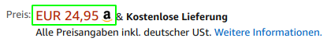

- **Search page**
  - Replaces search result prices with links to the product's [keepa](https://keepa.com) price history page.
  - Replaces search result product links with clean ones _(short URL, no tracking, affiliation, etc.)_.
- **Order overview**
  - Adds light green background to delivered, and orange background to open / shipped orders.

---

### Auto Show Forum Spoilers

> **Note:** Last updated 2021-02-23. This script may no longer work correctly with the current version of the site.

[auto-show-forum-spoilers.user.js](auto-show-forum-spoilers.user.js) automatically expands spoilers in common forums and collapsed "continue reading .." texts on patreon.com.

---

### Copy URL on Hover

[copy-url-on-hover.user.js](copy-url-on-hover.user.js) copies link/media URIs to the clipboard on mouse hover.

- Copies link URI into clipboard when hovering over a link while holding `Alt-C`.
- Tries to copy media (image/video) URI into clipboard when hovering over an image while holding `Alt-B`.
- Shows a brief tooltip indicating that the clipboard was updated:

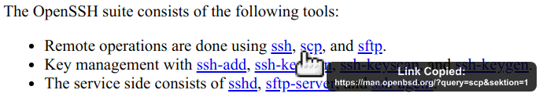

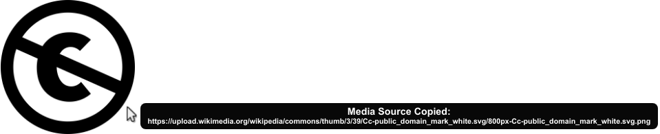

---

### DeTrigger

[cb-detrigger.user.js](cb-detrigger.user.js) filters potentially triggering elements to reduce emotional friction and foster a more serene browsing experience.

This script is still in its early stages, starting with the following simple filter:

- `https://civitai.com`
  - Remove the reaction emojis 😢 and 😂

---

### Domain Redirector

[domain-redirector.user.js](domain-redirector.user.js) redirects domains based on configurable mappings — a single script covering all redirect use cases instead of one script per site.

- Supports simple hostname rules (`reddit.com -> old.reddit.com`) and regex patterns on the full URL.
- Redirects fire at `document-start` before any content loads.
- Mappings are edited via a userscript extension (\*monkey menu command); export/import is done by copy-pasting the textarea.

### Emoji Replacer

[emoji-replacer.user.js](emoji-replacer.user.js) replaces emojis based on configurable mappings to personalize your browsing experience, or to reduce emotional friction by replacing potentially triggering emojis with more neutral alternatives.

- Supports simple emoji replacement rules (`🙁 <- 💩 🤮 🤬 😡 👿 😠`) based on configurable mappings.
- Mappings are edited via a userscript extension (\*monkey menu command); export/import is done by copy-pasting the textarea.

---

### Gerrit Tweaks

> **Note:** Last updated 2018-12-02. This script may no longer work correctly with the current version of the site.

[gerrit-tweaks.user.js](gerrit-tweaks.user.js) improves [gerrit code review](https://www.gerritcodereview.com/):

- Adds additional syntax highlighting for:
  - Exit keywords `return` and `throw`
  - Static method calls of Google Guava [Preconditions](https://github.com/google/guava/wiki/PreconditionsExplained) (potential exits)

  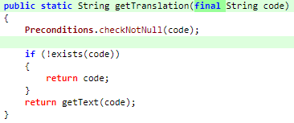

---

### Buhl Finanzblick

> **Note:** Last updated 2021-05-27. This script may no longer work correctly with the current version of the site.

[finanzblick-tweaks.user.js](finanzblick-tweaks.user.js) improves Buhl [Finanzblick](https://finanzblickx.buhl.de/):

- Replaces amazon order numbers in the booking list with links to the amazon.de order history.

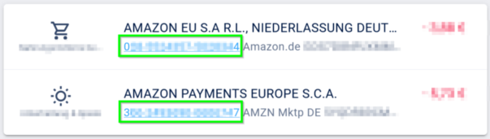

---

### Image Search Tweaks

> **Note:** Last updated 2019-12-07. This script may no longer work correctly with the current version of the site.

_PROTOTYPE ONLY_

[image-search-tweaks.user.js](image-search-tweaks.user.js) improves the [google](https://images.google.com) and [yandex](https://yandex.ru/images) image search.

| Keys  | Action |
|-------|--------|
| alt-s | Shuffle search result images ¹ |

¹ Only affects those images that are already loaded; to load more images page down first _(slowly, or you might end up with empty image frames only)_.

---

### IMDB Tweaks

> **Note:** Last updated 2020-10-26. This script may no longer work correctly with the current version of the site.

[imdb-tweaks.user.js](imdb-tweaks.user.js) improves [imdb](https://www.imdb.com/):

- Enforces a dark background _(a good idea with or without using [Dark Reader](https://chrome.google.com/webstore/detail/dark-reader/eimadpbcbfnmbkopoojfekhnkhdbieeh))_
- Adds new key bindings:

| Keys    | Action |
|---------|--------|
| Alt-F12 | Open script configuration (ESC to close) |

#### Episode List

- Adds direct season links to episode list _(top & bottom)_:

  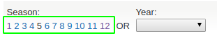

- Makes the list more compact _(default, configurable)_, adds hotkey `d` to toggle details:

  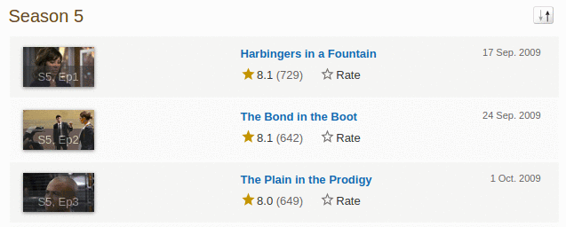

- Adds average season ratings _(all users and own, faded in case of missing ratings)_:

  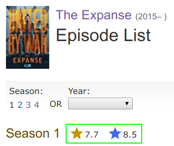

- Adds episode number to episode titles.
- Changes own rating star colors:
  - 1-4 → light gray
  - 5-6 → gray
  - 7 → blue _(average IMDB rating, regular star color)_
  - 8-9 → gold
  - 10 → gold _(larger star)_
- Adds new key bindings:

| Keys         | Action |
|--------------|--------|
| d            | Toggle compact list mode |
| [0-9]        | Navigate to season 0 to 9 _(if available)_ |
| Shift-[0-9]  | Navigate to season 10 to 19 _(if available)_ |
| [            | Navigate to previous season _(if available)_ |
| ]            | Navigate to next season _(if available)_ |

---

### Invoke-AI Tweaks

[invoke-ai-tweaks.user.js](invoke-ai-tweaks.user.js) adds some tweaks to [InvokeAI](https://invoke-ai.github.io/InvokeAI/).

- Batch run mode with sampler selection, custom prompts, and prompt snippets.
- Adds new key bindings:

| Keys | Action |
|------|--------|
| b    | Open batch invocation configuration dialog |

#### Batch Run

1. Open the dialog via the new hotkeys.

2. Select one or more samplers within the dialog:

   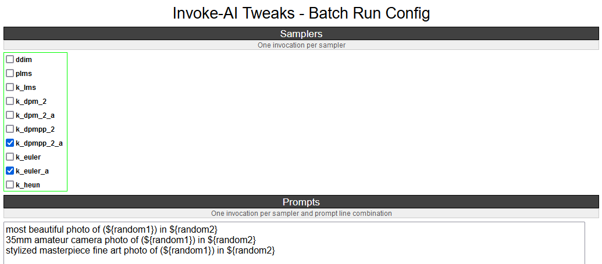

3. Optionally enter multiple prompt lines and/or up to five random value sets:

   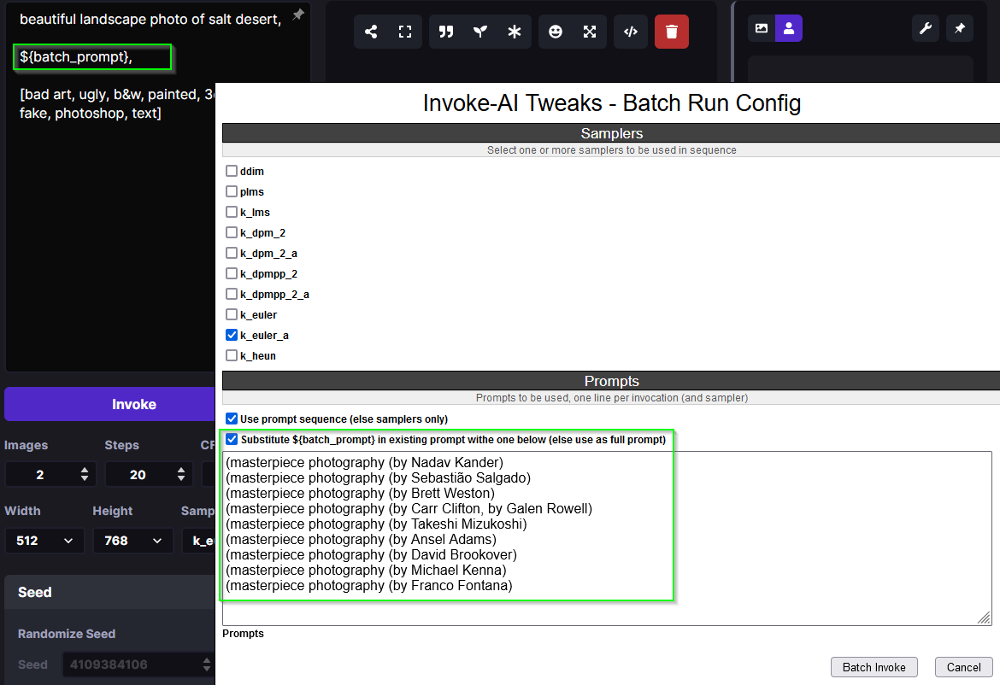

4. With the optional random iteration multiplier for each combination of prompt and sampler, additional random variations (invocations) can be generated, x for every base combination.

5. Start the batch run by pressing the `Batch Invoke` button which will set the samplers plus replace / substitute the prompt, with the optional prompt lines and random sets, one at a time (all combinations) and press the `Invoke` button afterwards:

   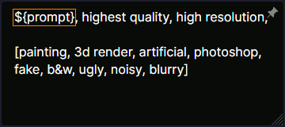

6. A tooltip will show updates while the batch run is in progress:

   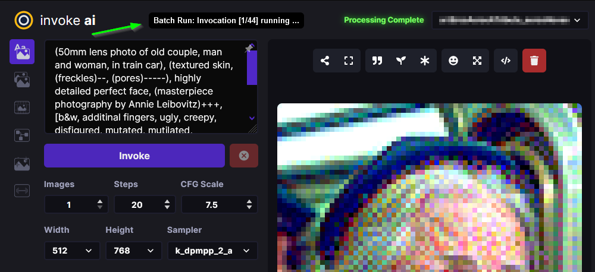

7. When the run is finished, or the dialog is opened again (stopping the batch run), the original prompt will be restored:

   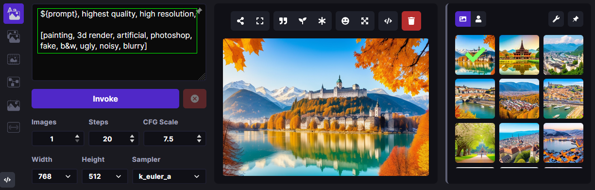

---

### Jenkins Tweaks

> **Note:** Last updated 2020-06-30. This script may no longer work correctly with the current version of the site.

[jenkins-tweaks.user.js](jenkins-tweaks.user.js) improves [Jenkins](https://jenkins.io/):

- Highlights errors, exceptions, warnings, success, test issues etc. in:
  - Job console output
  - Blue Ocean pipeline and test output

  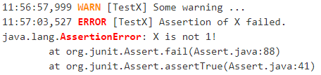

---

### OpenProject Tweaks

[openproject-tweaks.user.js](openproject-tweaks.user.js) improves OpenProject by adding things like:

- Highlights the user's own name (automatically detected).
- Highlights issue priority, status, and type (tracker).
- Highlights _[tags]_ and **bold** in issue subjects.
- Allows adding of additional custom styles _(substitute text fragments via generic regex search mechanism)_.
- **Markdown Source Editor Improvements**:
  - Increases editor height significantly (default: 65vh, configurable) for better overview
  - Automatically detects and enhances editors when switching between WYSIWYG ↔ Markdown modes
  - Reduces font size (default: 12px) to display more content
  - Configurable via constants at the top of the script:
    - `MARKDOWN_EDITOR_HEIGHT` — default height (e.g., `"65vh"`, `"800px"`)
    - `MARKDOWN_EDITOR_FONT_SIZE` — font size in source mode

---

### Search Hotkey

> **Note:** Last updated 2022-07-01. This script may no longer work correctly with the current version of the site.

[search-hotkey.user.js](search-hotkey.user.js) adds the `alt-f` hotkey to some pages for faster searching (focus search input field).

Currently supported pages:

- https://wikipedia.org
- https://fandom.com — entertainment & gaming wikis

---

### Streaming Tweaks

> **Note:** Last updated 2022-11-11. This script may no longer work correctly with the current version of the site.

[streaming-tweaks.user.js](streaming-tweaks.user.js) improves the user experience of some streaming services.

#### Netflix

Improvements to the [Netflix](https://netflix.com) web player:

- Automatically skips the intro _(where supported)_.
- Automatically skips to the next episode _(in closing credits view)_.
- Adds new key bindings:

| Keys          | Action |
|---------------|--------|
| Shift-Right   | Fast-forward 1min |
| Shift-Left    | Rewind 1min |
| Ctrl-Right    | Fast-forward 10min |
| Ctrl-Left     | Rewind 10min |
| . _(period)_  | Next episode |
| Alt-F12       | Open script configuration (ESC to close) |

- Configuration for:
  - Auto-skip intro and outro/to next episode (default: true)

#### Amazon Prime Video

Improvements to Amazon's [prime video](https://www.primevideo.com/) web player:

- Automatically skips the intro _(where supported)_.
- Automatically skips to the next episode _(in closing credits view)_.
- Automatically skips ads / trailers _(upfront & between episodes)_.
- Adds new key bindings:

| Keys          | Action |
|---------------|--------|
| Shift-Right   | Fast-forward 1min |
| Shift-Left    | Rewind 1min |
| Ctrl-Right    | Fast-forward 10min |
| Ctrl-Left     | Rewind 10min |
| . _(period)_  | Next episode |
| Alt-F12       | Open script configuration (ESC to close) |

- Configuration for:
  - Auto-skip intro and outro/to next episode (default: true)
  - Auto-skip ads (default: true)

_Note: If this doesn't work please check the include. Script currently only matches URLs `/^https?://(www|smile)\.amazon\.(de|com)/gp/video/`. Depending on how you reach the player, the `/gp/video/` might be missing in the URL._

#### YouTube

Improvements to [YouTube](https://www.youtube.com):

- Adds new key bindings:

| Keys          | Action |
|---------------|--------|
| Shift-Right   | Fast-forward 1min |
| Shift-Left    | Rewind 1min |
| Ctrl-Right    | Fast-forward 10min |
| Ctrl-Left     | Rewind 10min |
| . _(period)_  | Next video |
| , _(comma)_   | Previous video _(playlist only)_ |
| =             | Default playback rate (1x) |
| ]             | Increase playback rate (up to 2x) |
| [             | Decrease playback rate (down to 0.25x) |
| Shift-]       | Increase playback rate max (2x) |
| Shift-[       | Decrease playback rate min (0.25x) |
| U             | Toggle thumb up |
| D             | Toggle thumb down |
| Alt-F12       | Open script configuration (ESC to close) |

- Configuration for:
  - Default playback rate (default: 1x)
  - Stop auto-playback (stop playback when page opens, default: true)

#### Disney+

Improvements to the [Disney+](https://disneyplus.com) web player:

- Adds new key bindings:

| Keys          | Action |
|---------------|--------|
| Shift-Right   | Fast-forward 1min |
| Shift-Left    | Rewind 1min |
| Ctrl-Right    | Fast-forward 10min |
| Ctrl-Left     | Rewind 10min |
| F             | Toggle fullscreen |
| S             | Skip intro/outro (if auto-skip is off) |
| BACKSPACE     | Exit player |
| Alt-F12       | Open script configuration (ESC to close) |

- Configuration for:
  - Auto-skip intro and outro/to next episode (default: true)

#### Plex.TV

Improvements to the [Plex](https://plex.tv) web player:

- Adds new key bindings:

| Keys          | Action |
|---------------|--------|
| Shift-Right   | Fast-forward 1min |
| Shift-Left    | Rewind 1min |
| Ctrl-Right    | Fast-forward 10min |
| Ctrl-Left     | Rewind 10min |
| F             | Toggle fullscreen |
| M             | Toggle mute |
| BACKSPACE     | Exit player |
| Alt-F12       | Open script configuration (ESC to close) |

#### Spotify

Improvements to [Spotify](https://open.spotify.com):

- Adds new key bindings:

| Keys          | Action |
|---------------|--------|
| . _(period)_  | Next track |
| , _(comma)_   | Previous track _(if any)_ |
| r             | Switch Repeat Mode [All, Single, Off] _(playlist only)_ |
| s             | Toggle Shuffle _(playlist only)_ |
| /             | Open search |

#### ZDF Mediathek

Improvements to [ZDF](https://www.zdf.de) Mediathek _(including [3sat](https://www.3sat.de))_:

- Adds new key bindings:

| Keys  | Action |
|-------|--------|
| Right | Fast-forward 10sec |
| Left  | Rewind 10sec |
| =     | Default playback rate (1x) |
| ]     | Increase playback rate (up to 2x) |
| [     | Decrease playback rate (down to 0.25x) |

---

### TradingView

> **Note:** Last updated 2019-10-31. This script may no longer work correctly with the current version of the site.

Improvements to [TradingView](https://tradingview.com):

- Adds new key bindings:

| Keys         | Action |
|--------------|--------|
| Alt-1 to 0   | Click favorite quick access timeframe buttons 1 to 10 |
| Alt-f        | Toggle footer pane (_Pine Editor_, _Strategy Tester_, etc.) |
| Alt-Shift-f  | Toggle footer pane maximization |
| Alt-w        | Toggle _Watch List_ (right pane) |

---

## Libs & Resources

Common libs and resources used in some of my scripts.

| File | Description |
|------|-------------|
| [lib/cblib.js](lib/cblib.js)   | Some common JS used in my user scripts. |
| [lib/cblib.css](lib/cblib.css) | Some common CSS used in my user scripts. |
| [dev/](dev/)                   | Just some code snippets, notes, etc. that can be helpful while developing user scripts. |

---

## Q & A

- **Q: Why are the hotkeys (sometimes) not working as expected?**
  - A: Most of these scripts disable hotkeys while an input field is in focus _(e.g. cursor in YouTube search field while playing video)_ to prevent accidental hotkey execution while typing. Check if this is the case _(e.g. click onto the player first to focus it)_.
